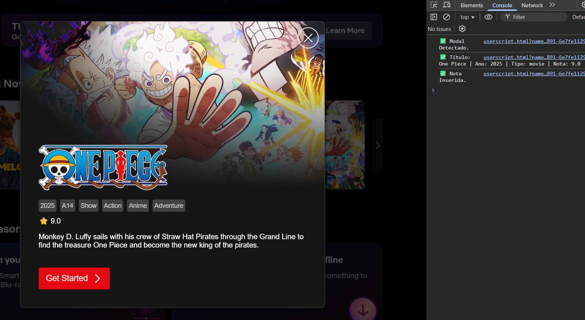
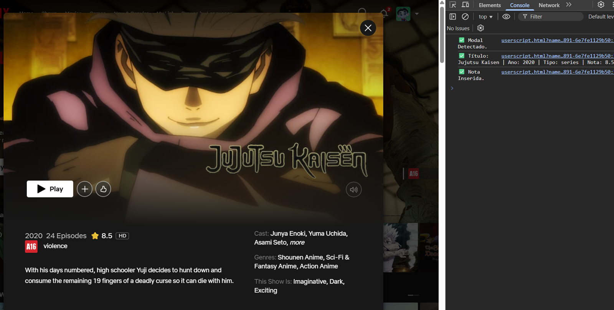
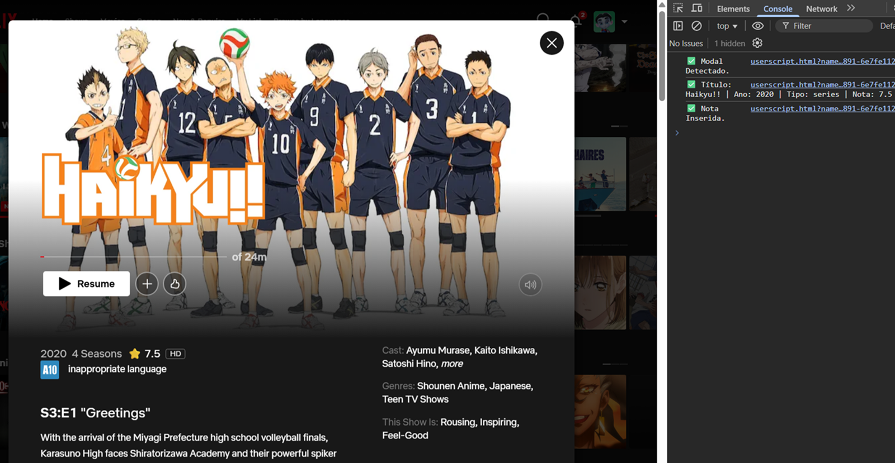

# OMDb Ratings For Netflix - CS50 Final Project

- The project aims to function as an extension, fetching information externally and returning a corresponding rating, enhancing the Netflix user experience by providing additional information about movies and series directly on the platform’s interface. This prevents users from wasting time watching something that isn’t good or manually searching for ratings.

### ⚙️ TECHNICAL DETAILS

- Technologies used: JavaScript, Tampermonkey, and OMDb.

- `main()`: Entry function of the script. Checks if the page is in English. This is necessary to ensure consistency when capturing Netflix elements, since it does not provide information like "Original Title." It then starts scanning the modals by calling escanear_modal().

- `escanear_modal()`: Uses MutationObserver to detect newly opened modals on the Netflix page. When a modal is identified, it extracts the title, year, and content type, marking the modal as processed to avoid duplicates. If the data is valid, meaning we have the title, year, and type, it then calls `buscar_nota_omdb()` to get the IMDb rating and `mostrar_nota()` to show it in the modal.

- `buscar_nota_omdb(titulo, ano, tipo)`: Performs a request to the API using the private key provided by OMDb. Since we are using Tampermonkey, for didactic purposes, the API key will be visible in Tampermonkey in the private video, but not on GitHub; if the data is not found using title, year, and type, since Netflix uses the current year and OMDb considers the release year, a second attempt is made without using the year as a parameter. With the response, we have all the data and save it in local storage using GM_setValue.

- `mostrar_nota(titulo, elemento)`: Dynamically creates a \ element to display the IMDb rating next to the content type (series or movie), avoiding duplication if the element already exists. The storage is persistent through GM_getValue / GM_setValue, ensuring that each title is processed only once, preventing multiple requests for the same title.

### 💡 DESIGN DECISIONS

- **Tampermonkey**: It was chosen because it allows the execution of custom scripts in the browser, integrating directly with the Netflix interface.

- **OMDb API**: A reliable source of IMDb data, simplifying the retrieval of ratings with a single HTTP request.

- **MutationObserver**: Necessary to monitor dynamic changes on the page, ensuring that modals are captured and processed as soon as they appear.

- **Storage**: Allows data to persist between modal updates and prevents unnecessary repeated requests to the API.

### 🧠 CHALLENGES AND LESSONS

- The main challenge was dealing with Netflix’s dynamic loading, which requires constant observation of the DOM to detect newly opened modals. Using MutationObserver was essential to overcome this difficulty, but it also took me some time to understand how it worked; I even tried using two MutationObservers, one inside the other, but realized that just one was enough.

- For educational purposes, the private key was shown during the video, but as best practices and security, it will only be found in the .env file.

- Another difficulty was standardizing the extraction of data, title, year, and type, across different modal layouts, since Netflix uses multiple templates. I learned to combine and conditionally extract information from alternative elements using selectors.

- Additionally, initially the script did not persist data, but implementing GM_setValue reduced unnecessary API calls, improving performance and reliability. Finally, the project reinforced concepts of asynchronous JavaScript, DOM manipulation, and integration with external APIs.

### 🔧 INSTALLATION AND USAGE

1. Install the **Tampermonkey** extension in your browser.
2. Create a new script and paste the project code.
3. Insert your OMDb API key in the indicated place.
4. Go to Netflix and open any title.
5. The IMDb rating will be displayed automatically next to the content type.

### 📚 CONCLUSION AND CREDITS

- This project was an excellent opportunity to put into practice the concepts learned in CS50, such as DOM manipulation, asynchronous requests, and integration with external APIs. It also helped me better understand how small automations can significantly improve the user experience.

- Developed by **Leandro R. Martins** for the course **CS50 - Introduction To Computer Science 2025**.

### 📸 EXECUTION IMAGES

